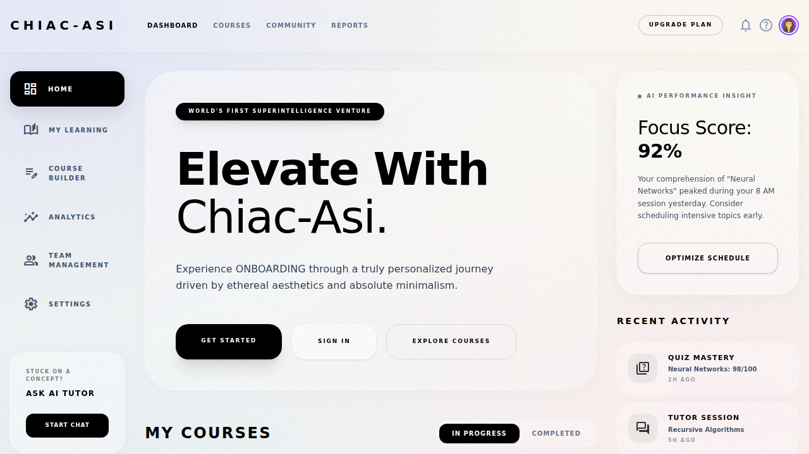
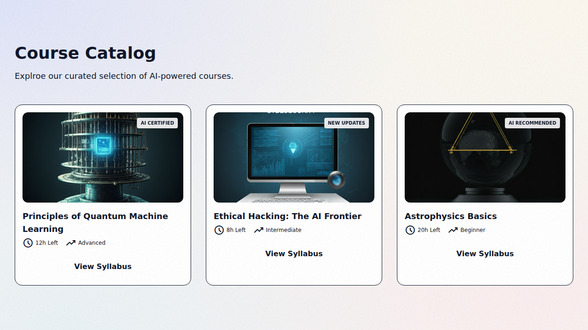

# Aura Learning Platform — AI-Powered B2B & B2C Learning Solution

A high-performance, scalable learning platform built for CHIAC-ASI, featuring automated content processing, AI tutoring, and multi-tenant organization support.

## 🚀 Key Features

### 🔐 Auth System Hardening
- **JWT with Refresh Token Rotation:** Secure session management with automatic token rotation and revocation.
- **RBAC:** Multi-level Role-Based Access Control (PLATFORM_ADMIN, ORG_ADMIN, MANAGER, MENTOR, LEARNER).

### 📚 Course & Learning Engine
- **Hierarchical Content:** Course → Module → Topic structure.
- **Material Versioning:** Track updates to course documents with version-controlled materials.
- **Idempotent Progress:** Robust topic locking and sequential unlocking rules.

### 🤖 AI Tutor & Assessment
- **RAG-based AI Chat:** Context-aware tutoring using Google Gemini 1.5 Flash, grounded in specific topic content.
- **AI Quiz Generation:** Automated generation of MCQs directly from course chunks.
- **Citation Mapping:** Grounded responses with source references to prevent hallucinations.

### 🏢 B2B Multi-tenancy
- **Organization Isolation:** Query-level RBAC ensuring zero data leakage between business entities.
- **Member Management:** Granular roles within organizations.

### 💳 Commerce & Scaling
- **Verified Payments:** Server-side HMAC signature verification for Razorpay.
- **Async Pipeline:** BullMQ + Redis for non-blocking PDF processing and AI tasks.
- **Standardized Logging:** Winston-based structured logging for audit and debugging.

---

## 🏗️ Technical Architecture

### Backend (NestJS)
Located in `apps/api`, follows a strict domain-driven structure:
- `modules/`: Domain logic (auth, courses, ai, learning, etc.)
- `repositories/`: Abstracted database layer using the **Repository Pattern**.
- `common/`: Shared guards, decorators, and global exception filters.

### AI Service (FastAPI)
Located in `apps/ai-service`, handles stateless AI/ML tasks:
- **PDF Processing:** Parsing and token-aware chunking.
- **Generation:** RAG-based chat and MCQ synthesis via Gemini API.

### Frontend (Next.js)
Located in `apps/web`, modern UI with feature-based organization:
- `features/`: Modular UI components (auth, quiz, ai-chat).
- `services/`: Centralized API clients.

---

## 📸 Screenshots

### Dashboard Overview

*Central hub for learners to track progress and access enrolled courses.*

### Course Discovery

*Interactive course catalog with pricing and enrollment management.*

### System Verification

*End-to-end user journey verification for signup and course access.*

---

## 🛠️ Setup & Installation

### Prerequisites
- Node.js 18+
- MySQL 8.0
- Redis
- Python 3.9+ (for AI Service)

### 1. Database Configuration
```bash
# In MySQL
CREATE DATABASE aura_learning;
```

### 2. Backend API
```bash
cd apps/api
npm install
npx prisma generate
npx prisma db push
npm run build
npm run start:dev
```

### 3. AI Service
```bash
cd apps/ai-service
pip install -r requirements.txt
# Set GEMINI_API_KEY in .env
uvicorn main:app --port 8000
```

### 4. Frontend
```bash
cd apps/web
npm install
npm run dev
```

---

## 📜 Coding Standards
- **Strict TypeScript:** No `any` types (except where casting Prisma returns for flexibility).
- **Validation:** All inputs validated via `class-validator` DTOs.
- **Logic Separation:** Services handle business logic; Repositories handle data; Controllers handle routing.
