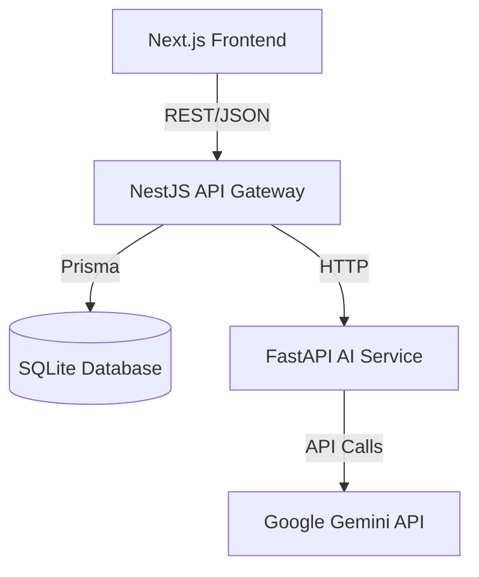

# AI books library

A comprehensive, high-performance, and scalable full-stack platform built for creating, managing, and consuming educational content. The system features an advanced hierarchical course engine, a B2B multi-tenant organization structure, and a dedicated AI service for processing course materials and providing real-time AI tutoring and assessment.

---

## 🏛️ System Architecture

The AI Books Library is built using a modern, decoupled microservices-inspired architecture designed for maintainability and scalability.

### High-Level Flow
1. **Client Layer:** Next.js application serves static and dynamic pages. Communicates securely with the API layer via REST/JSON.
2. **Business Logic Layer:** NestJS serves as the central brain. It handles Auth, payments, data persistence (via Prisma + SQLite), and acts as a gateway for AI requests.
3. **Intelligence Layer:** FastAPI Python service dedicated exclusively to CPU-intensive AI workloads (PDF text extraction, intelligent chunking, and LLM communication with Google Gemini).



---

## 💻 Technology Stack

### Frontend (`apps/web`)
- **Framework:** Next.js 16 (App Router), React 19
- **Styling:** Tailwind CSS 4 with custom Glassmorphism UI components.
- **Icons:** Lucide React
- **Authentication:** JWT-based Context Provider (`auth-context.tsx`).

### Backend (`apps/api`)
- **Framework:** NestJS 11
- **Database ORM:** Prisma 6
- **Database:** SQLite (for local development; previously MySQL 8.0)
- **Security:** Passport.js, JWT, bcrypt (password hashing), Class Validator.
- **Logging:** Winston (structured logging).
- **Task Queue:** BullMQ / Redis (available but optional for local development).

### AI Service (`apps/ai-service`)
- **Framework:** FastAPI (Python)
- **PDF Processing:** PyPDF2
- **AI Integration:** Google Generative AI (Gemini 1.5 Flash), OpenAI SDK (compatible).

---

## 📂 Project Directory Structure

```text
/ (Workspace Root)
├── apps/
│   ├── api/                  # NestJS Backend Core
│   │   ├── prisma/           # Database Schema (schema.prisma) & Migrations
│   │   └── src/
│   │       ├── common/       # Global guards, filters, and decorators
│   │       ├── modules/      # Domain models (auth, courses, ai, learning)
│   │       └── repositories/ # DB abstraction layer
│   │
│   ├── ai-service/           # FastAPI Python Intelligence Layer
│   │   ├── main.py           # API endpoints for PDF extraction & chat
│   │   └── requirements.txt  # Python dependencies
│   │
│   └── web/                  # Next.js Frontend App
│       ├── app/              # Next.js App Router pages
│       ├── features/         # Modular React UI components
│       └── services/         # API HTTP client configurations
└── README.md
```

---

## 📊 Core Data Model (Domain Entities)

The system relies on a robust relational data model managed by Prisma:

- **Users & Orgs:** `User`, `Organization`, `OrganizationMembership`, `LearnerProfile`
  - Multi-tenant model where users can have distinct roles (`PLATFORM_ADMIN`, `ORG_ADMIN`, `MANAGER`, `MENTOR`, `LEARNER`) within specific organizations.
- **Course Hierarchy:** `Course` 1..N `Module` 1..N `Topic`
  - Deeply nested course structures supporting idempotent progress tracking.
- **Learning Assets:** `Material` (Files/PDFs), `ContentChunk` (Extracted text for AI embeddings).
- **Assessments:** `Question`, `QuestionOption`, `QuizAttempt`, `LearnerAnswer`.
- **Commerce:** `CourseEnrollment`, `Payment` (integrated with Provider logic e.g., Razorpay/Stripe).

---

## 🚀 Deep-Dive: Core Features

### 1. B2B Multi-Tenancy & Auth
- **JWT Refresh Rotation:** Enhanced security through short-lived access tokens and rotatable refresh tokens stored securely in the database.
- **Organization Isolation:** Database queries automatically scope to the user's organization context, preventing cross-tenant data leakage.

### 2. The Learning Engine
- **Admin Course Builder:** Extensive tools for educators to build courses, set difficulty, define price, and organize materials logically.
- **Sequential Unlocking:** The `TopicProgress` engine enforces rules so learners must complete preceding modules to unlock new content.

### 3. Retrieval-Augmented Generation (RAG) AI Pipeline
The AI tutor uses a custom RAG architecture to prevent hallucinations:
1. **Ingestion:** Educator uploads a PDF to a topic.
2. **Extraction:** NestJS forwards the file to the FastAPI service.
3. **Chunking:** FastAPI uses PyPDF2 to extract text and splits it into logical `ContentChunk` blocks.
4. **Sanitization:** String sanitization prevents invisible control characters from breaking JSON payloads.
5. **Tutoring:** When a learner asks a question, the API grabs the topic's `ContentChunks` and injects them into the Gemini 1.5 prompt as ground-truth context.
6. **Quiz Synthesis:** The same chunks are used by the LLM to dynamically generate relevant multiple-choice questions.

---

## 🛠️ Setup & Local Installation

### Prerequisites
- Node.js 18+ (20+ recommended)
- Python 3.9+
- SQLite (Built-in via Prisma)

### Step 1: Database & Backend API
```bash
cd apps/api

# Install backend dependencies
npm install

# Initialize SQLite database and sync schema
npx prisma generate
npx prisma db push

# Start the NestJS development server (Port 3001)
npm run start:dev
```

### Step 2: AI Intelligence Service
```bash
cd apps/ai-service

# Create an isolated python environment
python -m venv venv
source venv/bin/activate  # Windows: venv\Scripts\activate

# Install AI dependencies
pip install -r requirements.txt

# Start the FastAPI development server (Port 8000)
uvicorn main:app --port 8000 --reload
```

### Step 3: Frontend Web Application
```bash
cd apps/web

# Install frontend dependencies
npm install

# Start Next.js development server (Port 3000)
npm run dev
```

---

## 🔒 Environment Variables

Copy these configurations into local `.env` files in their respective directories.

**`apps/api/.env`**
```env
DATABASE_URL="file:./dev.db"
JWT_SECRET="your-super-secret-jwt-key"
# Optional depending on current config:
# REDIS_URL="redis://localhost:6379"
```

**`apps/ai-service/.env`**
```env
GEMINI_API_KEY="your-google-gemini-api-key"
```

**`apps/web/.env`**
```env
NEXT_PUBLIC_API_URL="http://localhost:3001"
```

---

## 📜 Coding Standards & Practices

- **Strict Typing:** TypeScript strict mode is enforced. Avoid `any` types. Ensure all database calls map accurately to Prisma generated types.
- **Validation Pipeline:** NestJS uses `class-validator` and `class-transformer` pipes to strictly validate all incoming DTOs before they hit the controller.
- **Repository Pattern:** Database interactions are abstracted out of services and into Repositories, making testing and database swapping easier.
- **Atomic Operations:** Important database transactions (like course enrollments and payment success) use Prisma `$transaction` blocks to prevent orphaned data.
- **UI Styling:** Maintain the Glassmorphism aesthetic. Favor CSS utility composition over inline styles. Use Lucide for consistent iconography.
